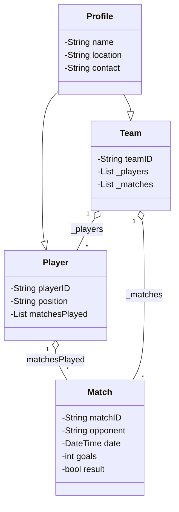

# SPORTS TOURNAMENT TRACKER

**_[Author: Thao Nguyen](https://github.com/xxnancyng/Dart_Projects/tree/main/sports_tracker)_**

This project is a sport tournament tracker built with Dart. It provides an easy-to-use application to organize and monitor local sports events. This tracker is designed to help players, coaches, and organizers manage local competitions more effectively.

## Features:

- **Player Profiles:** Store players' information including name, location, contact details, player ID, position, and their match history.
- **Team Management:** Allow coaches to manage teams, track match results, and monitor overall performance across tournaments.
- **Match Scheduling:** Help organizers schedule matches, record scores, opponent, date and update results (win/loss/draw) in real time.
- **Performance Insights:**
    - Calculate team wins, losses, and points.
    - Track individual player match history and statistics.

## Entities & Relationships:

1. Base Class – ```Profile```
- Holds ```name```, ```location```, ```contact``` information (for players, teams, and tournament organizers).
    ```bash
    class Profile {
        String name;
        String location;
        String contact;
    }
    ```

2. ```Player``` (**extends** ```Profile```)
- Attributes: ```playerID```, ```position```, ```matchesPlayed```.
- Mixin: ```PlayerMixin``` to update performance statistics.
    ```bash
    class Player extends Profile {
        String playerID;
        String position;
        final List<Match> matchesPlayed;
    }
    ```

3. ```Team``` (**extends** ```Profile```)
- Attributes: ```teamID```, ```players```, ```matches```.
- Mixin: ```TeamMixin``` to calculate total points, wins, losses.
    ```bash
    class Team extends Profile {
        String teamID;
        final List<Player> _players;
        final List<Match> _matches;
    }
    ```

4. ```Match```
- Attributes: ```matchID```, ```opponent```, ```date```, ```goals```, ```result```
    ```bash
    class Match {
        String matchID;
        String opponent;
        DateTime date;
        int goals;
        bool result;
    }
    ```


5. ```Tournament```
- Attributes:```tournamentID```, ```name```, ```teams```, ```matches```, ```standings```
- Mixin: ```TournamentMixin``` to schedule matches and update standings.
    ```bash
    class Tournament {
        String tournamentID;
        String name;
        List<Team> teams = [];
        List<Match> matches = [];
        Map<Team, int> standings;
    }
    ```


## Class Diagram:




## Main Workflow:
1. Create players and teams
2. Schedule matches
3. Record match results
4. Update standings
5. View team & player stats

## Running the Program
To run this Dart program:

- **Step 1:** Make sure you have the Dart SDK installed. (Official website: [https://dart.dev/get-dart](https://dart.dev/get-dart)).

- **Step 2:** Clone the repository
   ```bash
   git clone https://github.com/xxnancyng/Dart_Projects.git
   cd Dart_Projects/sports_tracker
    ```
- **Step 3:** Navigate to the project folder where the ```bin/main.dart``` file is located.

- **Step 4:** Run the main program
    ```bash
    dart run bin/main.dart
    ```

- **Step 5:** Expected output (Example)
    ```bash
    Players on team: 2
    Team wins: 3
    Team losses: 2
    Team points (computed): 9
    ```
